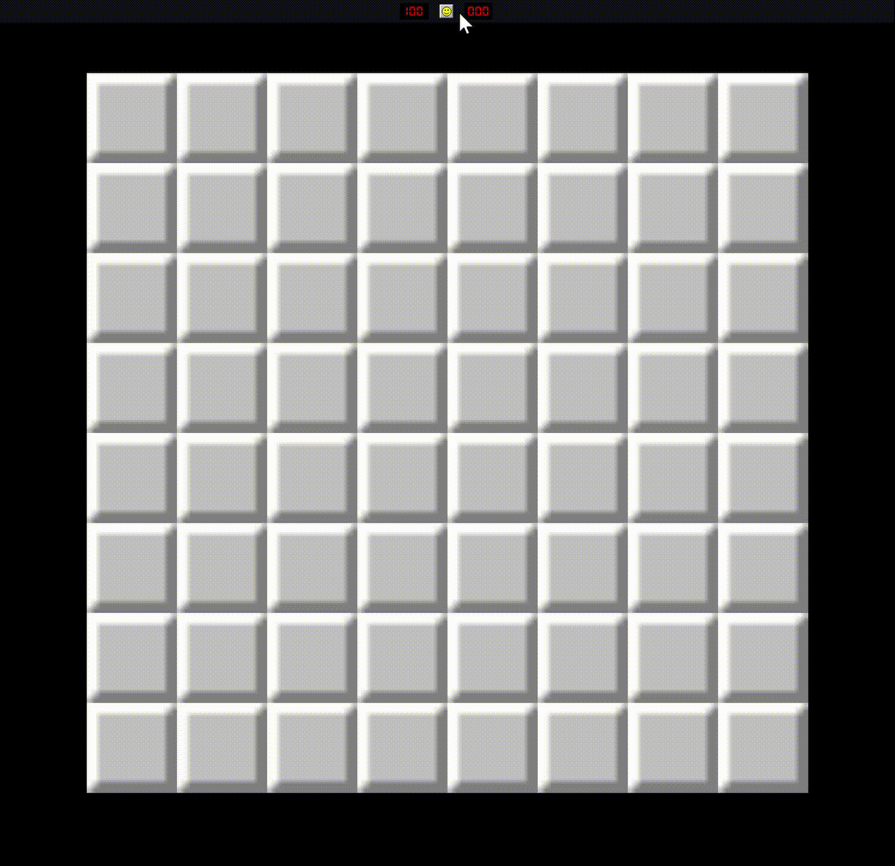

# Minesweeper made with Godot in C #

This game is the continuation of [**Minesweeper**](https://github.com/wojciech-bilicki/MinesweeperTutorial) game developed by [**Wojciech Bilicki**](https://github.com/wojciech-bilicki) rewritten into Godot C#. 

## Gameplay

## Credits

Credits to [**Wojciech Bilicki**](https://github.com/wojciech-bilicki) that made a great tutorial in Youtube channel [**CyberPotato**](https://www.youtube.com/@CyberPotatoDev) with video [**How to make Minesweeper in Godot 4 (Complete Tutorial)**](https://www.youtube.com/watch?v=LEiL4rrZbqQ), provide us on how to use Godot with every detail that needs to be learned.
